# Raccoon Learning App

## Screenshots my project

<table>
  <tr>
    <td>
      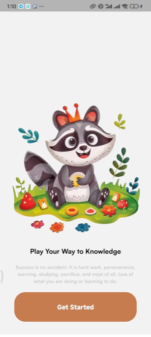
      
<b>Image 1:</b> Introduction Page

    </td>
    <td>
      
      
<b>Image 2:</b> Register or signin

    </td>
  </tr>
  <tr>
    <td>
      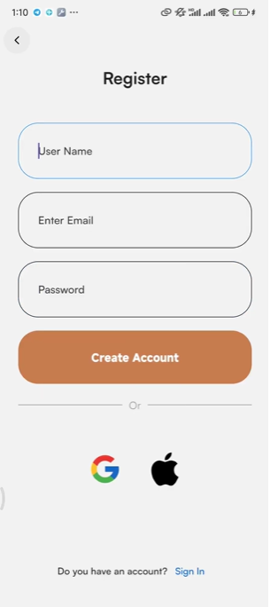
      
<b>Image 3:</b> Register

    </td>
    <td>
      
      
<b>Image 4:</b> Sign In

    </td>
  </tr>
    <tr>
    <td>
      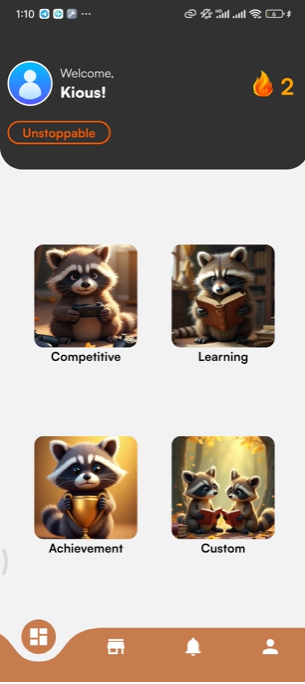
      
<b>Image 5:</b> Home Page

    </td>
    <td>
      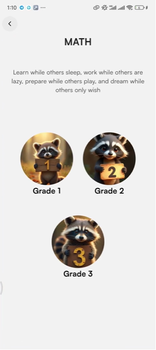
      
<b>Image 6:</b> Learning

    </td>
  </tr>
    <tr>
    <td>
      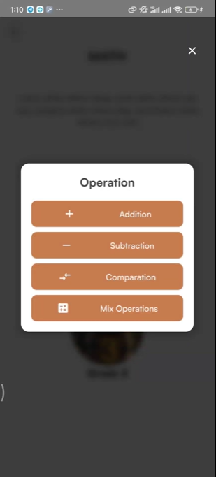
      
<b>Image 7:</b> Choose Mode

    </td>
    <td>
      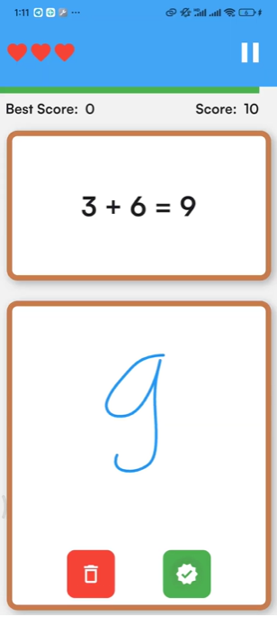
      
<b>Image 8:</b> Playing

    </td>
  </tr>
    <tr>
    <td>
      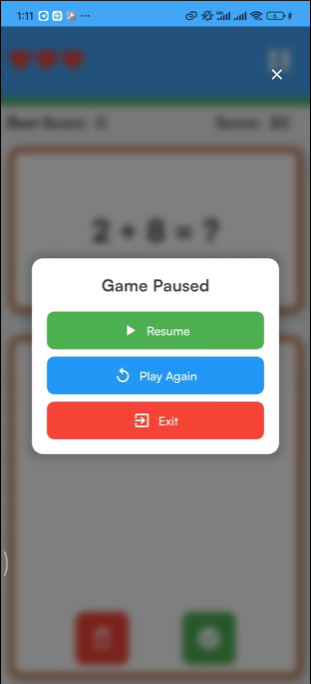
      
<b>Image 9:</b> Pause Game

    </td>
    <td>
      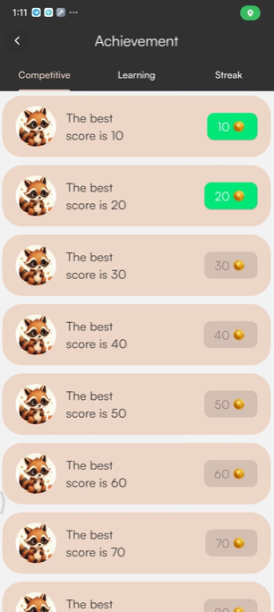
      
<b>Image 10:</b> Achievement Page

    </td>
  </tr>
    <tr>
    <td>
      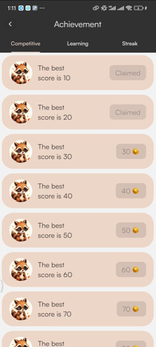
      
<b>Image 11:</b> Claimed Achievement

    </td>
    <td>
      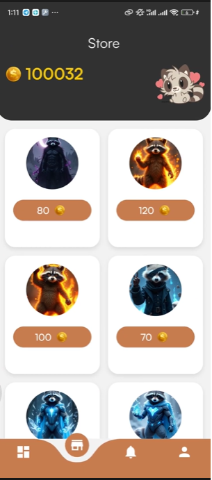
      
<b>Image 12:</b> Store Page

    </td>
  </tr>
    <tr>
    <td>
      
      
<b>Image 13:</b> Profile Page

    </td>
    <td>
      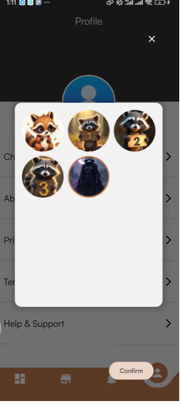
      
<b>Image 14:</b> Choose avatar to change (can buy from store)

    </td>
  </tr>
    <tr>
    <td>
      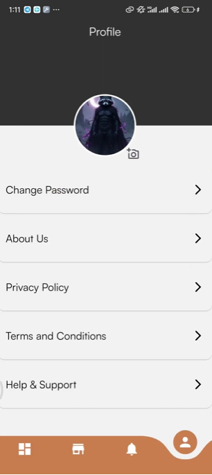
      
<b>Image 15:</b> Change successful

    </td>
    <td>
      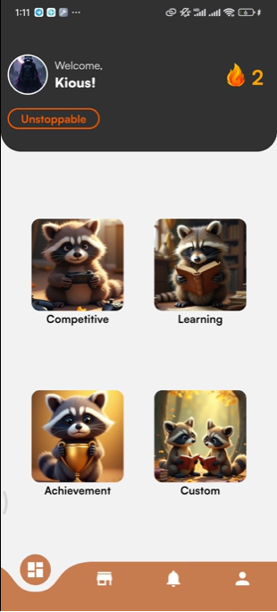
      
<b>Image 16:</b> Avatar is changed in Home

    </td>
  </tr>
</table>
